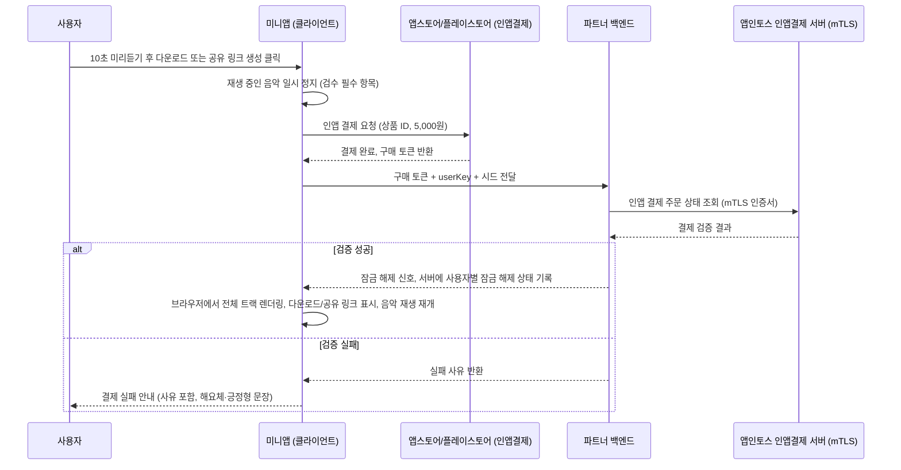

# Krachwerk 개발 기획서

시드 기반 절차적 전자음악 생성기. 1단계는 웹앱, 2단계는 토스미니앱으로 확장하며 미니앱에서 유료화를 진행한다.

> **버전 노트**: 이 문서는 기존 `모터릭 제너레이터 개발 기획서.html`을 대체한다. 서비스명을 `Krachwerk`로 확정했고, 앱인토스 공식 개발자 문서(노출 정책, 서비스 오픈 정책, 게임/비게임 출시 가이드, UI/UX 가이드, 정산, 저작권, 마케팅 가이드)를 원문 기준으로 다시 조사해 반영했다. 또한 Kraftwerk가 2011년에 실제로 출시했던 음악 생성 앱 `Kling Klang Machine`의 비주얼 레퍼런스를 디자인 시스템에 반영했고, 매트릭스 시퀀서를 실시간 인터랙티브 시드 편집기로 구체화했다.
>
> **추가 개정**: 2.2의 색상을 크래프트베르크 네온그린 그대로 쓰지 않는 방향으로 전환하고, TJ의 GitHub 프로필 배너 SVG에서 확정한 팔레트(흰색 `#fafaf8`, 네온그린 `#39d353`, 파란색 `#58a6ff` 순위 고정 + 후보색 6종)와 폰트(`Courier New, monospace`)를 2.2.1에 반영했다(5.1, 5.2 동기화 완료). 한국어/영어 다국어 지원 요구사항을 5.4에 추가했다. 세션이 바뀌어도 이 문서만으로 개발에 착수할 수 있도록 0.1에 시작 전 확인 체크리스트를 추가했다.

---

## 0. 문서 사용 안내

이 문서는 실제 개발을 맡을 코딩 에이전트(클로드 코드)에게 그대로 전달할 기획서다. 문서 안에서 스택 선택, 코드 구조, API 사용법처럼 구체적인 구현 방법을 적어둔 부분은 전부 초안이고 참고용이다. 더 좋은 방법을 알고 있다면 에이전트가 알아서 판단해서 자유롭게 바꿔서 구현해도 된다.

반드시 지켜야 하는 것은 4장에 적어둔 비즈니스 목적과 서비스 흐름, 그리고 6장에 정리한 앱인토스 플랫폼 정책이다. 화면이 몇 개 있고 각 화면에서 무엇을 할 수 있어야 하는지, 무료와 유료의 경계가 어디인지, 두 앱이 무엇을 공유해야 하는지, 그리고 앱인토스 심사에서 반려당하지 않기 위한 최소 기준은 구현 방법이 아니라 서비스의 정체성이자 출시 조건이므로 임의로 바꾸면 안 된다.

### 0.1 시작 전 확인 체크리스트 (다른 코딩 에이전트로 세션이 바뀌는 경우 필수)

이 기획서는 여러 세션에 걸쳐 작성됐고, 실제 개발은 이 문서를 처음 보는 별도의 코딩 에이전트 세션에서 시작될 가능성이 크다. 대화 기록이나 이전 세션의 첨부 파일은 새 세션으로 자동으로 넘어오지 않으므로, 개발에 들어가기 전에 아래를 확인한다.

- [x] **레퍼런스 컬러/폰트 확보**: 2.2.1에 TJ의 GitHub 프로필 배너 SVG를 기반으로 팔레트(`#fafaf8`/`#39d353`/`#58a6ff` + 후보색)와 폰트(`Courier New, monospace`)가 확정돼 있다. 5.1, 5.2도 이 값으로 갱신됐다.
- [ ] Kling Klang Machine 참고 이미지(2.1, 2.2, 11장): https://kraftwerk.com/KKM/kkm.html 페이지와 그 안의 스크린샷(`Screenshot02/03/05/07.PNG`, `kkm_textINT.gif`, `KKM-DR1/DR2.gif`)을 직접 열어서 화면 구성·인터랙션 레퍼런스로 참고한다.
- [ ] 콘솔 MCP 연결 여부(8.3): `apps-in-toss-console` MCP와 플러그인이 연결돼 있는지 확인하고, 없다면 8.3에 적힌 명령으로 연결한다.
- [ ] 9장 일정표의 현재 주차, 진행 중인 작업이 있는지 TJ에게 확인한다(이 문서 자체에는 실시간 진행 상태가 기록돼 있지 않다).

---

## 1. 서비스 정체성과 네이밍

### 1.1 서비스명: Krachwerk

**어원**: 독일어 `Krach`(굉음, 소음, 쾅 소리) + `Werk`(공장, 작업장, 제작소). Kraftwerk(발전소)가 실존하는 평범한 독일어 단어를 그대로 브랜드명으로 쓰면서 "우리는 동력을 만드는 기계"라는 자기지칭적 컨셉을 살린 것처럼, `Krachwerk`도 "소음을 찍어내는 공장"이라는 뜻이 그대로 통하는 조어이자, 발음과 리듬감이 `Kraftwerk`와 거의 겹쳐서 오마주라는 게 바로 드러난다.

**포지셔닝**: 개발자용/글로벌 브랜드명으로는 `Krachwerk`를 그대로 쓴다. 레포지토리, 웹앱 도메인, 크레딧, 디자인 시스템 문서(`DESIGN.md`) 등 개발자와 얼리어답터가 접하는 모든 곳에서는 이 이름을 유지한다.

| 용도 | 이름 |
|---|---|
| 메인 웹앱 레포 | `krachwerk` |
| 토스미니앱 레포 | `krachwerk-toss` |
| 웹앱 배포 경로 | `htjworld.github.io/krachwerk/{seed}` |

### 1.2 토스미니앱 표시명은 별도로 한글로 짓는다 (필수)

앱인토스 UI/UX 가이드 원문을 확인한 결과, 브랜드 이름 규정에 이렇게 명시돼 있다.

> "브랜드 이름은 전체 탭, 혜택 탭, 푸시, 알림, 내비게이션, 브릿지에 노출돼요. **특별한 이유가 없다면 한글로 작성해 주세요.** 예를 들면 `토스`는 가능하지만 `Toss`는 권장하지 않아요."

즉 `Krachwerk`라는 영문 조어를 토스 미니앱의 정식 표시명으로 그대로 쓰는 것은 권장되지 않는다. 실제로 토스 미니앱 인기 순위에 오르는 서비스들의 이름을 보면(`한게임 싱글 맞고`, `정글 매치 퍼즐`, `인스타 언팔한 사람 찾기`, `돌돌디`, `거지키우기`, `하루스토리`) 브랜드 조어를 그대로 쓰는 경우보다, 무엇을 하는 앱인지 이름만 보고 바로 알 수 있게 짓는 경우가 압도적으로 많다. `애니팡`처럼 이미 전 국민이 아는 IP가 아닌 이상, 나머지는 전부 기능을 그대로 설명하는 식이다.

여기에는 이유가 있다. 토스 앱 사용자 중 상당수는 20대보다 40~60대 비중이 크고, 이 연령대는 "전자음악 생성기"나 "시드 기반 절차적 생성" 같은 개념 자체를 접해본 적이 없는 경우가 많다. 조어형 브랜드명은 이 사용자층에게 진입장벽이 된다. 반대로 "숫자 하나로 만드는 전자음악"처럼 동작을 그대로 설명하는 이름은 클릭 전에 이미 무엇을 얻을지 예상하게 해주는데, 이는 앱인토스 노출 정책이 요구하는 "UX 원칙 5번(사용자가 기대한 결과를 보여주고, 그 의미도 함께 알려주기)"과도 직접 맞닿아 있다.

**결론**: 브랜드명(`Krachwerk`)과 토스 미니앱 표시명(한글)을 분리한다.

| 구분 | 값 | 노출 위치 |
|---|---|---|
| 브랜드명 (글로벌) | Krachwerk | 앱 내 크레딧, 웹앱, 공유 링크 OG 텍스트, 개발자 문서 |
| 토스 미니앱 표시명 (국문, 콘솔 등록) | 아래 후보 중 확정 필요 | 전체 탭, 혜택 탭, 푸시, 내비게이션 바 |
| appName (ID, 영구 고정) | `krachwerk` (소문자·숫자·대시만) | URL, 콘솔 내부 식별자 |

**토스 미니앱 표시명 후보**

| 후보 | 의도 |
|---|---|
| **숫자 하나로 만드는 전자음악** | 시드 개념을 "숫자 하나"로 완전히 풀어씀. 원 기획서의 "숫자 또는 문자열 시드 하나로" 컨셉과 정확히 일치 |
| **전자음악 무한 생성기** | 가장 짧고 직관적. "무한"이 반복재생/끝없이 다른 결과라는 차별점을 바로 전달 |
| 나만의 전자음악 만들기 | "나만의" 소유격이 공유·커스텀 느낌을 강조 |
| 배경음악 자동 생성기 | 실사용 목적(스트리머, 유튜버 BGM)에 가장 가깝지만 장르 정체성이 안 드러남 |

이 중 **"숫자 하나로 만드는 전자음악"** 또는 **"전자음악 무한 생성기"**를 우선 추천한다. 내비게이션 바나 로고 옆에는 `Krachwerk`를 부제(서브 브랜드)로 작게 병기하는 방식(예: 로고 텍스트 자체를 "Krachwerk"로 하고, 콘솔 등록명만 국문으로 별도 관리)도 가능한지 콘솔 등록 시 확인이 필요하다. 확인이 어렵다면 국문 표시명을 1순위로 따른다.

### 1.3 한 줄 정의

숫자 또는 문자열 시드 하나로 크라프트베르크풍(모터릭 리듬 기반) 전자음악 루프를 절차적으로 생성하는 도구. 같은 시드는 언제, 어디서, 누가 열어도 항상 같은 결과를 재현한다.

### 1.4 핵심 차별점

| 구분 | 규칙 |
|---|---|
| 리듬 그리드 | 16스텝 고정, 정박만 사용. 스윙이나 휴머나이즈 없음 |
| 드럼 레이어 | 시드와 무관하게 항상 동일한 패턴. 이 트랙만 들어도 장르 정체성이 드러남 |
| 음색 소스 | 시드마다 서로 다른 신스 보이스 조합을 선택. 소스 자체가 다양해지는 지점 |
| 멜로디, 스케일 | 시드마다 다른 스케일과 진행을 선택하되 한 번 정해지면 루프 내내 고정 반복 |

정리하면 박자는 기계처럼 일관되고, 음색과 멜로디는 시드마다 완전히 다르다는 것이 제품의 정체성이다. 이건 우연이 아니라 Kraftwerk 음악 자체의 특징이기도 하다. 아래 2장에서 다룬다.

### 1.5 타깃 사용자

배경음악이 필요한 개발자, 스트리머, 유튜버, 로파이/신스웨이브 계열 무한 재생 음악을 원하는 사람, 재미로 자기만의 시드를 만들어 링크로 공유하고 싶은 사람.

---

## 2. 크리에이티브 레퍼런스: Kraftwerk의 Kling Klang Machine

Kraftwerk는 2011년 3월, `Kling Klang Machine`이라는 24시간 자동 음악 생성 iOS 앱을 실제로 출시한 적이 있다. 세계 시간대를 보여주는 지도 위에서 시간에 따라 자동으로 곡이 바뀌고, 사용자가 파라미터를 직접 조작해 실시간으로 사운드를 바꿀 수 있는 인터랙티브 제너레이터였다. Krachwerk가 만들려는 것과 컨셉 자체가 거의 동일한 선례이므로, 기능 설계와 비주얼 레퍼런스 양쪽에서 참고 가치가 크다.

### 2.1 화면 구성 레퍼런스

| 화면 | 구성 | Krachwerk 적용 아이디어 |
|---|---|---|
| 월드맵 / 시계 | 세계지도 위에 시간대별 세로 밴드, 하단에 시:분 표시, 좌우 화살표로 시간대 이동 | 첫 화면 헤더를 이 톤으로: 시드 입력창 위에 얇은 세로 그리드 배경, 좌우 화살표로 "이전/다음 추천 시드" 탐색 |
| 인터랙티브 컨트롤 (크로스헤어) | 4개의 와이어프레임 마네킹(밴드 멤버 오마주) 위에 십자선(crosshair) 커서, 십자선을 드래그하면 템포·톤이 실시간으로 바뀜. 하단에 SAVE/1/2/RESET | 4개의 신스 보이스 슬롯(베이스, 리드, 드럼, 텍스처)을 미니멀 와이어프레임 아이콘으로 표시하고, 십자선 드래그로 템포(X축)·톤/필터(Y축)를 실시간 조정 |
| 믹서 (세그먼트 바) | VOL / ECHO / REV / TUNE / EFX / TEMPO 6개 채널을 계단식(segmented) 세로 바로 표시, 각 바 아래 숫자값 | 오디오 엔진의 실제 파라미터(볼륨, 딜레이, 리버브, 튠/디튠, 필터, 템포)를 그대로 매핑한 "고급 설정" 패널 |
| 매트릭스 시퀀서 | 16~32스텝 그리드, MELO/DRUM 탭 전환, 스텝을 누르면 그 자리에 노트가 켜짐, 재생 위치는 회색 세로 바로 표시 | 3.2에서 다루는 "실시간 시드 에디터"의 시각적 기준. 아래 5.4에서 상세 스펙 정의 |

### 2.2 색상 시스템: 화이트 ↔ 네온그린 5초 교차 (1차 초안, 2.2.1로 대체 예정)

> **중요**: 이 2.2 절의 `#39ff14` 네온그린은 Kling Klang Machine 스크린샷에서 그대로 가져온 값이라 레퍼런스를 너무 직접적으로 베낀 느낌이 든다는 판단이 내려졌다. 실제 구현은 아래 **2.2.1**에서 정의하는, TJ의 GitHub 프로필 배너 SVG에서 확정한 팔레트를 기준으로 한다. 이 절은 애니메이션 구조(디바이스 고정 + 바깥 배경 크로스페이드)와 타이밍 로직의 기준으로만 남겨두고, 실제 색상값은 2.2.1을 따른다.

Kling Klang Machine의 스크린샷을 보면 기기(디바이스) 화면 자체는 항상 검정 배경에 네온그린 텍스트로 고정돼 있지만, 그 기기를 감싸는 **바깥 배경(페이지 배경)**은 옅은 화이트/그레이와 형광 네온그린 사이를 오간다. 이 대비 덕분에 화면 안의 그리드와 텍스트는 항상 또렷하게 읽히면서도, 페이지 전체는 살아있는 것처럼 느껴진다.

Krachwerk 웹앱(Phase 1)에는 이 구조(디바이스 고정 / 바깥 배경 크로스페이드)는 그대로 적용하되, 색상값은 2.2.1의 팔레트로 치환한다.

- **디바이스 뷰(고정)**: 배경은 거의 검정 계열, 전경은 2.2.1의 메인 포인트 컬러, 모노스페이스 폰트. 매트릭스, 믹서, 시드 입력창 등 실제로 조작하는 모든 요소는 이 안에 고정된다.
- **바깥 배경(5초 교차 애니메이션)**: 디바이스 바깥 여백이 5초 간격으로 오프화이트 ↔ 포인트 컬러 사이를 크로스페이드한다. 전체 주기는 10초(색상 A 5초 유지 → 1초 미만의 부드러운 전환 → 색상 B 5초 유지 → 전환). 급격한 점멸이 아니라 서서히 바뀌는 크로스페이드로 구현해 광과민성 문제를 피한다. 2.2.1에서 확정한 대로 파란색은 배경 순환에 넣지 않고 보조 액센트로만 쓴다.

```css
/* 색상값은 2.2.1에서 확정된 --ref-off-white / --ref-neon-green 토큰 */
@keyframes krachwerk-ambient {
  0%, 45%   { background-color: var(--ref-off-white); }  /* #fafaf8 */
  50%, 95%  { background-color: var(--ref-neon-green); } /* #39d353 */
  100%      { background-color: var(--ref-off-white); }
}
.ambient-bg {
  animation: krachwerk-ambient 10s ease-in-out infinite;
}
```

- 파비콘, 로딩 화면, 공유 링크 OG 이미지 배경에도 같은 색상 페어를 쓴다.
- 접근성: `prefers-reduced-motion: reduce` 사용자에게는 애니메이션을 끄고 고정된 오프화이트 배경만 보여준다.

### 2.2.1 실제 반영 팔레트: TJ의 GitHub 프로필 배너 SVG 기반 (확정)

레퍼런스는 사진이 아니라 TJ의 GitHub 프로필 README에 쓰이는 터미널 스타일 배너 SVG 코드 그 자체였다. 코드에 색상이 HEX로 정확히 박혀 있어서 스포이드 없이 그대로 확정할 수 있었다. 목적은 2.2의 순수 크래프트베르크 네온그린 오마주보다 TJ 개인 브랜드에 더 가까운 톤으로 옮겨오는 것이다.

**메인 3색 (우선순위 고정)**

| 순위 | 토큰 | HEX | SVG 원본 출처 | 용도 |
|---|---|---|---|---|
| 1 | `--ref-off-white` | `#fafaf8` | 터미널 본문 텍스트(연락처, whoami 결과, json 값 등 대부분의 흰 텍스트) | 바깥 배경 애니메이션 색상 A(2.2), 밝은 배경의 기본 텍스트색 |
| 2 | `--ref-neon-green` | `#39d353` | `ls ./projects` 결과의 프로젝트명(`art-bridge`, `art-run` 등) | 포인트 컬러, 바깥 배경 애니메이션 색상 B(2.2), 디바이스 전경(`--fg-device`) |
| 3 | `--ref-blue` | `#58a6ff` | 프롬프트(`htjworld@github:~$`), ASCII 아트, 커서 | 세 번째 포인트 컬러. 링크·버튼·포커스 상태 등 액센트로 사용(배경 크로스페이드에는 넣지 않음, 아래 적용 규칙 참고) |

> `--ref-neon-green` 후보로 `#3fb950`(json 값, 체크마크에 쓰인 좀 더 차분한 초록)도 SVG 안에 있었지만, "네온그린"이라는 표현에는 더 채도가 높은 `#39d353` 쪽이 맞아서 이쪽을 메인으로 확정했다. `#3fb950`은 아래 후보색 목록에 별도로 남겨둔다.

**적용 규칙**

- 2.2의 바깥 배경 크로스페이드 애니메이션은 `--ref-off-white`(`#fafaf8`) ↔ `--ref-neon-green`(`#39d353`) 2색 순환을 그대로 유지한다(3색 순환으로 확장하지 않는다 — TJ가 "흰색+네온그린이 메인, 파란색은 3등"이라고 명확히 순서를 정했다).
- `--ref-blue`(`#58a6ff`)는 배경 애니메이션이 아니라 링크, 버튼 hover/focus, 강조 텍스트, 진행 상태 표시 같은 **보조 액센트**로 쓴다.
- 디바이스 뷰(생성기 내부)의 배경은 SVG의 터미널 배경 `#0d1117`(거의 검정, 2.2의 `#0a0a0a`보다 약간 더 파란 기가 도는 검정)로 교체한다. 타이틀바 톤인 `#21262d`는 디바이스 안의 패널 구분선이나 버튼 배경 등에 보조로 쓸 수 있다.

**후보색 (3색 다음으로 필요할 때만 사용)**

메인 3색으로 대부분의 UI를 구성하고, 그래도 색이 더 필요한 지점(배지, 상태 표시, 세부 강조 등)에만 아래 순서대로 꺼내 쓴다.

| 토큰 | HEX | SVG 원본 출처 | 참고 |
|---|---|---|---|
| `--ref-cyan` | `#00d4e8` | velog 링크 텍스트 | |
| `--ref-magenta` | `#ff0090` | 이메일 텍스트 | |
| `--ref-gold` | `#d29922` | json 키(`"languages"` 등) | |
| `--ref-kakao-yellow` | `#FEE500` | "Top 3 finalist" 강조 | 카카오 브랜드 컬러라 마케팅 소재에 그대로 쓰면 안 되고, UI 강조색으로만 참고 |
| `--ref-green-soft` | `#3fb950` | json 값, 체크마크 | 메인 네온그린(`#39d353`)보다 차분한 보조 초록 |
| `--ref-muted-1` | `#8b949e` | 타이틀바 텍스트 | 보조 설명 텍스트, 비활성 상태 |
| `--ref-muted-2` | `#6e7681` | 주석/부가 설명 텍스트 | 가장 낮은 우선순위의 보조 텍스트 |

**폰트 (확정)**: SVG 코드에 `font-family="Courier New, monospace"`로 명시돼 있다. 디바이스 뷰 전용 서체를 이 값으로 확정한다: `font-family: "Courier New", monospace;`. 웹폰트를 따로 로드할 필요 없이 시스템 폰트로 커버되므로, 5.2의 `JetBrains Mono` / `IBM Plex Mono` 후보는 폴백으로만 남겨둔다(`"Courier New", "JetBrains Mono", monospace` 순서 권장).

**원본 SVG 코드 (참고용, 전체 보존)**

코딩 에이전트가 정확한 톤·레이아웃 감을 잡을 수 있도록 TJ가 제공한 원본 SVG를 그대로 남겨둔다. 이건 TJ의 GitHub 프로필 README 배너이므로 Krachwerk 서비스에 그대로 쓰는 게 아니라 **색상·폰트·터미널 톤의 출처 레퍼런스**로만 쓴다.

```xml
<svg xmlns="http://www.w3.org/2000/svg" width="680" height="706">
  <style>
    @keyframes blink { 0%,100%{opacity:1} 50%{opacity:0} }
    .blink { animation: blink 1s step-end infinite; }
  </style>
  <rect width="680" height="706" fill="#0d1117" rx="12"/>
  <rect width="680" height="36" fill="#21262d" rx="12"/>
  <rect y="24" width="680" height="12" fill="#21262d"/>
  <circle cx="18" cy="18" r="6" fill="#ff5f57"/>
  <circle cx="36" cy="18" r="6" fill="#febc2e"/>
  <circle cx="54" cy="18" r="6" fill="#28c840"/>
  <text font-family="Courier New, monospace" fill="#8b949e">htjworld — bash</text>
  <!-- ASCII 아트, whoami, skills.json, ls ./projects, status.txt 섹션은
       #58a6ff(파랑, 프롬프트/ASCII 아트), #fafaf8(흰색, 본문),
       #3fb950/#39d353(초록 계열, 값/프로젝트명), #d29922(골드, json 키),
       #00d4e8(시안, velog 링크), #ff0090(마젠타, 이메일),
       #FEE500(카카오 옐로우, 강조), #6e7681(뮤트 그레이, 주석) 조합으로 구성.
       전체 원본은 TJ가 md 업데이트 요청 메시지에 첨부한 SVG 파일 참고. -->
</svg>
```

**참고**: 2.1~2.2의 Kling Klang Machine 화면 구성 레퍼런스(https://kraftwerk.com/KKM/kkm.html)는 인터랙션·레이아웃 참고용으로 계속 유효하다. 색상만 위 2.2.1 팔레트로 완전히 대체한다.

### 2.3 Phase 2(토스미니앱)의 색상 제약과 절충안

6.4에서 자세히 다루지만, 앱인토스는 현재 미니앱의 **다크 모드를 지원하지 않고 라이트 모드 기준으로만 심사·출시**할 수 있다. 즉 토스미니앱 화면 전체를 검정 배경으로 만들면 심사에서 반려될 가능성이 크다.

해결책은 Kling Klang Machine 스크린샷이 이미 보여주고 있다. **바깥 프레임은 밝게, 안쪽 "기기 화면"만 어둡게** 만드는 구조를 그대로 가져오면 된다.

- 토스미니앱의 내비게이션 바, 배경, 여백, 버튼, 본문 텍스트는 밝은 배경 + 어두운 텍스트로 구성해 앱인토스 라이트 모드 기준을 만족시킨다.
- 화면 중앙에 배치하는 "생성기 디바이스"(매트릭스, 크로스헤어, 믹서)는 검정 배경에 네온그린으로 그대로 유지한다. 이건 사진이나 목업이 아니라 실제로 작동하는 하드웨어 장비의 화면처럼 보이게 하는 디자인 장치이므로, 전체 테마 규정 위반이 아니라 "콘텐츠 영역 안의 디바이스 스킨"으로 해석될 여지가 크다. 다만 이 해석이 실제 심사에서 통과되는지는 반드시 사전에 채널톡으로 확인해야 한다(10.1 리스크 참고).
- 5초 색상 교차 애니메이션은 토스미니앱에서는 배경 전체가 아니라 디바이스 테두리의 얇은 글로우 라인에만 적용한다(과한 배경 플리커는 다크패턴 심사에서 "장식적 이펙트 남용"으로 지적될 수 있음).

### 2.4 저작권·상표 관련 주의사항 (중요)

Kling Klang Machine 앱 화면 하단에는 실제로 `IMPRESSUM: COPYRIGHT KRAFTWERK / EMI GROUP PLC.`라는 저작권 표기가 있다. Krachwerk는 다음 원칙을 반드시 지킨다.

- `KLING KLANG MACHINE`이라는 명칭, 로고, 정확한 UI 텍스트(`MELO`, `DRUM` 같은 라벨은 흔한 음악 용어라 괜찮지만 전체 화면 카피 재현은 지양)를 그대로 복제하지 않는다. "영감을 받은 톤"까지만 가져오고, 라벨 문구와 세부 레이아웃은 Krachwerk 고유의 것으로 다시 만든다.
- Kraftwerk 밴드명, 로고, 멤버 이미지, 앨범 아트를 마케팅이나 앱 내 그래픽에 사용하지 않는다.
- "크라프트베르크풍", "모터릭 장르"처럼 장르·스타일을 지칭하는 표현은 일반적인 음악 용어이므로 사용 가능하지만, 앱 설명 문구에서 Kraftwerk를 마치 공식 협업이나 라이선스 관계가 있는 것처럼 암시해서는 안 된다.
- 자세한 절차는 6.7(저작권 침해 신고 대응)에서 다룬다.

---

## 3. 전체 로드맵

| 단계 | 범위 | 배포 | 수익 모델 |
|---|---|---|---|
| Phase 1 | 웹앱 (풀 기능 무료) | GitHub Pages, GitHub Actions로 자동 배포 | 없음 |
| Phase 2 | 토스미니앱 | 토스 콘솔 심사 후 배포 | 인앱결제로 다운로드 또는 공유 링크 생성 시 5,000원 |

> Phase 2의 결제 수단이 기존 초안(토스페이)에서 **인앱결제**로 바뀐 이유는 6.2와 7.5에서 설명한다.

---

## 4. 서비스 흐름과 비즈니스 요구사항 (필수, 임의 변경 금지)

### 4.1 웹앱 화면 흐름

1. 첫 화면(시드 선택 화면): 시드 직접 입력, 랜덤 생성 버튼, 그리고 4.2에서 설명하는 성향 선택 버튼들
2. 생성 버튼
3. 생성 완료 화면: 음악 플레이어(재생, 정지), 다운로드 버튼, 링크 복사 버튼

생성, 재생, 다운로드까지 전부 무료이고 서버 없이 브라우저 안에서만 처리된다.

### 4.2 성향을 고른 다음 무작위로 생성하기

사용자가 매번 완전히 무작위인 결과만 받는 게 아니라, 원하는 방향을 살짝 정해두고 그 방향에 맞는 무작위 결과를 받고 싶어한다는 요구사항이다.

첫 화면에 활성화 버튼(토글) 형태로 성향 태그를 배치한다. 태그 예시(실제 문구와 종류는 에이전트가 다듬어도 됨).

- 베이스 강조
- 특이한 음색 위주
- 미니멀한 멜로디
- 화려한 멜로디

규칙은 다음과 같다.

- 서로 상충하는 태그는 하나만 고를 수 있는 그룹으로 묶는다. 예를 들어 미니멀한 멜로디와 화려한 멜로디는 같은 그룹에 두고 라디오 버튼처럼 동작시킨다.
- 상충하지 않는 태그끼리는 여러 개 동시에 선택할 수 있다.
- 태그를 고르고 생성 버튼을 누르면, 그 조건에 맞는 결과가 나올 때까지 후보를 걸러내거나 다시 뽑는 방식으로 최종 시드 하나를 사용자에게 보여준다.
- 결과로 나온 시드값 자체는 완전한 정보여야 한다. 즉 나중에 태그 선택 없이 그 시드값만 다시 입력해도 완전히 동일한 트랙이 재현되어야 한다. 태그는 시드를 고르는 과정을 도와주는 필터일 뿐이고, 재현의 기준은 언제나 시드값 하나다.

### 4.3 시드 값과 공유 링크 규칙

원하는 형태는 이런 것이다.

```
htjworld.github.io/krachwerk/133r53252rwersa
```

저장소 이름 뒤에 시드값을 바로 붙인 경로 하나로 접속하면, 그 링크를 여는 모든 사람에게 항상 동일한 트랙이 재현되어야 한다. (실제 배포 도메인은 `github.io`이고 `github.com`이 아니라는 점만 참고, 나머지 경로 구조는 원하는 대로다.)

시드값은 숫자로 한정하지 않고 `133r53252rwersa` 같은 임의의 문자열도 허용해서, 사실상 무한한 개수의 서로 다른 시드를 만들 수 있어야 한다는 요구사항도 있다. 이건 가능하다. 입력 문자열을 문자열 해시 함수로 하나의 시드값으로 변환해서 내부 생성 로직에 넣으면, 사용자가 입력할 수 있는 문자열의 가짓수는 사실상 무한이고 그 각각이 서로 다른 조합으로 이어진다. 정확히 무한이라기보다는 사람이 입력할 수 있는 범위 안에서는 무한에 가깝다고 보면 된다. 구체적인 해시 방식은 7장의 구현 초안을 참고.

### 4.4 실시간 매트릭스 에디터와 파생 시드 (신규)

2.1에서 언급한 매트릭스 시퀀서 화면을 단순한 시각화가 아니라 **직접 조작 가능한 인터랙티브 에디터**로 만든다. Kling Klang Machine의 매트릭스 화면(스텝을 누르면 그 자리가 켜지고, 회색 세로 바가 현재 재생 위치를 보여주는 구조)을 그대로 인터랙션 기준으로 삼는다.

**동작 규칙**

- 생성 완료 화면에 "패턴 보기/편집" 버튼을 추가한다. 누르면 현재 시드로 생성된 16스텝 그리드가 실제 패턴 그대로 시각화된다(드럼 레이어, 멜로디 레이어를 탭으로 전환).
- 사용자가 그리드의 특정 칸을 탭하면 그 자리의 노트가 켜지거나 꺼진다. 이 변경은 즉시 오디오 엔진에 반영되어 재생 중인 루프가 바로 바뀐다(끊김 없이, 다음 마디 시작 지점에 맞춰 반영하는 것을 권장).
- 사용자가 그리드를 바꾸는 순간, 그 변경사항은 "패턴 오버라이드"로 별도 인코딩되어 원래 시드 뒤에 덧붙는 두 번째 파라미터가 된다. 즉 최종 공유 링크는 `.../{seed}?pattern={encoded-diff}` 형태가 되고, 이 링크를 여는 모든 사람에게는 기존 시드가 생성한 기본 패턴이 아니라 **사용자가 편집한 버전 그대로**가 재현된다.
- `pattern` 파라미터가 없으면 시드만으로 기본 패턴을 그대로 재생한다. 즉 편집은 선택 사항이고, 안 건드리면 기존 4.3의 동작과 동일하다.
- "무작위로 다시 섞기" 버튼을 매트릭스 화면에도 둬서, 그리드를 처음부터 새로 만들지 않고도 그 자리에서 바로 다른 시드로 넘어갈 수 있게 한다(3.1의 첫 화면으로 돌아가지 않아도 되는 지름길).

**비주얼 스펙**

- 배경은 순검정(`#0a0a0a`), 셀은 꺼짐 상태에서 아주 옅은 회색 격자선만 보이고, 켜진 셀은 네온그린(`#39ff14`)으로 채운다.
- 현재 재생 위치는 셀보다 약간 어두운 회색(`#3a3a3a`) 세로 바로 표시하고, 그 바가 그리드를 좌에서 우로 스캔한다.
- 4스텝마다(4, 8, 12, 16) 그리드 위에 작은 숫자 라벨을 둔다.
- 좌우 여백에는 `SEED`(현재 시드 짧게 표시), `SHUFFLE`(무작위 재섞기), `SHARE`(패턴 포함 링크 복사), `RESET`(원래 시드로 되돌리기) 네 개의 텍스트 버튼만 둔다. 아이콘 없이 모노스페이스 대문자 텍스트로만 구성해서 2.2의 디바이스 룩을 유지한다.
- 한 화면에 그리드는 하나만 크게 보여주고, 드럼/멜로디는 그리드 위 작은 탭 두 개로 전환한다(Kling Klang Machine의 MELO/DRUM 탭과 동일한 패턴).

### 4.5 크로스헤어 컨트롤 (신규, 선택 기능)

매트릭스 화면과 별도로, 첫 화면이나 재생 화면에 "라이브 컨트롤" 탭을 하나 추가할 수 있다(우선순위는 매트릭스 에디터보다 낮음, 여유가 되면 구현).

- 화면 중앙에 4개의 미니멀 와이어프레임 아이콘(단순 선으로 그린 사람 형태 또는 사각 블록)을 가로로 배치한다. 각각 베이스, 리드, 드럼, 텍스처 레이어를 상징하고, 현재 시드에서 그 레이어가 활성 상태인지에 따라 밝기가 달라진다.
- 화면 위에 십자선(가는 흰색 가로선 + 세로선)을 두고, 사용자가 드래그하면 가로 이동은 템포(104~132 BPM 범위, 4.2의 오디오 엔진 스펙과 동일), 세로 이동은 필터 컷오프나 톤을 실시간으로 조정한다.
- 하단에는 `SAVE` `1` `2` `RESET` 네 개의 슬롯 버튼을 둬서, 마음에 드는 컨트롤 조합을 두 개까지 저장하고 즉시 불러올 수 있게 한다(Kling Klang Machine의 메모리 슬롯 컨셉 재현).
- 이 조정값도 4.4와 마찬가지로 공유 링크의 파라미터로 인코딩해, 링크를 여는 사람에게 같은 컨트롤 상태가 재현되게 한다.

### 4.6 토스미니앱 화면 흐름과 무료, 유료 경계

- 생성은 무제한, 완전 무료. 이건 AI로 계산하는 게 아니라 정해진 규칙에 따라 계산하는 것이고, 그 계산 자체는 최대한 서버가 아니라 클라이언트(브라우저) 쪽에서 처리한다. 웹앱이 서버 없이 깃허브 페이지 하나로 돌아가는 것과 같은 방향성을 유지한다.
- 생성이 끝나면 10초 미리듣기까지는 무료로 제공한다.
- 전체 다운로드나 공유 링크 생성은 5,000원 결제 후에만 가능하다. **결제 수단은 인앱결제(Google/Apple In-App Purchase)로 한다.** 이유는 6.2 참고.
- 결제를 유도하는 톤은 무거운 구매가 아니라 개발자에게 커피 한 잔 사주는 것 같은 가볍고 후원에 가까운 느낌이어야 한다. 실제 문구나 화면 구성은 에이전트가 다듬어도 되지만, 이 톤은 지켜야 한다. 단, 6.4의 UX 라이팅 규정(해요체, 능동형, 긍정형 문장, 과도한 경어 지양)을 반드시 함께 지킨다.
- 인앱 결제·인앱 광고가 실행되는 동안 재생 중인 음악은 반드시 일시정지해야 한다(6.3 체크리스트 필수 항목).

### 4.7 공용 코드 원칙

웹앱과 토스미니앱은 같은 오디오 엔진, 같은 화면 구성, 같은 UI 컴포넌트를 최대한 그대로 공유해야 한다. 다만 2.3에서 설명했듯 토스미니앱은 라이트 모드 프레임을 씌워야 하므로, 색상 토큰만 테마 레이어로 분리해서 웹앱 다크 테마와 미니앱 라이트 프레임 테마를 갈아 끼울 수 있게 한다. 두 앱의 기능적 차이는 다운로드·링크 생성을 막을지 말지, 그리고 그걸 풀기 위해 결제를 요구할지뿐이다. 이 차이 하나 때문에 코드베이스 전체를 나누는 일은 없어야 하고, 그 부분만 교체 가능한 구조로 분리해야 한다.

---

## 5. 디자인 시스템

### 5.1 팔레트

> 아래 값은 2.2.1에서 확정된 TJ의 GitHub 프로필 배너 SVG 기반 팔레트다.

**웹앱 (Phase 1, 다크 전용)**

| 토큰 | 값 | 용도 |
|---|---|---|
| `--bg-device` | `#0d1117` | 디바이스(생성기) 배경 |
| `--fg-device` | `#39d353` | 디바이스 전경(텍스트, 활성 셀) — 메인 네온그린 |
| `--fg-device-dim` | `#3fb950` 또는 이를 더 어둡게 한 톤 | 비활성 셀, 보조선 |
| `--bg-ambient-a` | `#fafaf8` | 바깥 배경 애니메이션 색상 A(흰색) |
| `--bg-ambient-b` | `#39d353` | 바깥 배경 애니메이션 색상 B(네온그린) |
| `--accent-blue` | `#58a6ff` | 3순위 포인트 컬러. 링크, 버튼 hover/focus, 강조 텍스트(배경 애니메이션에는 미사용) |
| `--panel` | `#21262d` | 디바이스 안 패널 구분선, 버튼 배경 등 보조 |
| `--playhead` | `#3a3a3a` | 재생 위치 표시 바 |

**후보색(2.2.1 참고)**: 위 팔레트로 부족할 때만 `--ref-cyan #00d4e8`, `--ref-magenta #ff0090`, `--ref-gold #d29922`, `--ref-kakao-yellow #FEE500`, `--ref-muted-1 #8b949e`, `--ref-muted-2 #6e7681` 순서로 사용한다.

**토스미니앱 (Phase 2, 라이트 프레임 + 다크 디바이스)**

| 토큰 | 값 | 용도 |
|---|---|---|
| `--bg-shell` | `#ffffff` | 내비게이션 바, 여백, 앱 프레임 배경 (앱인토스 라이트 모드 요건) |
| `--fg-shell` | `#191f28` | 프레임 안 본문 텍스트 |
| `--accent` | `#39d353`을 4.5:1 대비 기준으로 보정한 톤 | 버튼, 브랜드 컬러(콘솔 등록용, 5.2 참고) |
| `--bg-device` / `--fg-device` | 웹앱과 동일(`#0d1117` / `#39d353`) | 생성기 디바이스 영역만 다크 유지 |

브랜드 컬러는 UI/UX 가이드의 규정에 따라 로고에서 가장 많이 쓰인 색을 뽑아 등록한다. 네온그린(`#39d353`)은 색 대비 기준(WCAG)을 충족하지 못할 가능성이 커서, 콘솔에 등록하면 자동으로 톤이 보정된다는 점을 미리 감안한다. 필요하면 짙은 그린(`#3fb950` 급, 2.2.1의 `--ref-green-soft`)으로 한 톤 낮춘 대체 브랜드 컬러를 준비해둔다.

### 5.2 타이포그래피

- 디바이스 영역: `"Courier New", monospace`(2.2.1에서 SVG 코드로 확정). 폴백 순서는 `"Courier New", "JetBrains Mono", monospace`. 전부 대문자 라벨 금지(원 기획서 5장의 "라벨을 전부 대문자로 쓰는 습관" 지양 규칙은 유지하되, 디바이스 안의 짧은 버튼 라벨(`SAVE`, `SEED`, `SHARE` 등)은 레트로 하드웨어 UI를 흉내 내는 의도적 장치이므로 예외로 둔다. 문장형 카피, 설명 텍스트는 절대 전부 대문자로 쓰지 않는다).
- 한글 라벨이 필요한 지점(5.4 다국어 지원 참고)에는 `Courier New`가 한글을 지원하지 않으므로 `"Courier New", "D2Coding", "Noto Sans Mono CJK KR", monospace` 순서의 폴백 스택을 쓴다.
- 프레임 영역(토스미니앱 라이트 프레임, 웹앱 설명 텍스트): 시스템 기본 산세리프, 일반 대소문자 표기.

### 5.3 톤 원칙 (기존 유지)

톤은 다크, 미니멀, 일렉트로닉이다. 다음 요소는 쓰지 않는다.

- 가운데 점, 긴 대시(이중 하이픈)
- 문장이나 버튼 끝에 붙는 화살표 기호
- 라벨을 전부 대문자로 쓰는 습관(5.2의 디바이스 예외 제외), 강조를 위해 한 단어만 굵게 또는 기울임으로 처리하는 습관, 내용과 상관없이 붙는 눈썹 라벨처럼 뻔한 AI 생성물 특유의 표현
- 애플 이모지. 아이콘이나 일러스트가 꼭 필요하면 이모지 대신 실제 일러스트 소스를 찾아서 쓰는 쪽을 우선한다. (토스미니앱에서는 6.4의 토스 제공 아이콘/이모지 세트를 UI 용도로만 제한적으로 쓸 수 있고, 앱 로고나 썸네일에는 쓸 수 없다는 점도 함께 참고)

실제로 검색해보니 2026년 기준으로 프로젝트 루트에 `DESIGN.md` 파일을 하나 두고, 코딩 에이전트가 세션을 시작할 때 그 파일을 먼저 읽고 색상, 타이포그래피, 컴포넌트 규칙을 따르게 하는 방식이 바이브코딩 커뮤니티에서 사실상 표준으로 자리잡은 상태다. 실제 구현에 들어가기 전에 이 방식대로 `DESIGN.md`를 먼저 작성하고 시작하는 것을 권장한다. 위 5.1~5.3의 팔레트, 타이포그래피, 톤 원칙, 그리고 2.2~2.3의 애니메이션 스펙을 그대로 `DESIGN.md`의 뼈대로 옮기면 된다.

참고할 만한 소스 후보(TJ의 깃허브 스타 목록에 이미 들어있는 것들).

- `VoltAgent/awesome-design-md`: 유명 브랜드 디자인 시스템들을 정리한 DESIGN.md 모음. 이 중 다크하고 일렉트로닉한 톤에 맞는 것을 골라 커스터마이즈하는 출발점으로 쓸 수 있다.
- `bitjaru/styleseed`: 디자인 판단을 도와주는 에이전트 스킬 모음.
- `Leonxlnx/taste-skill`: 뻔하고 일반적인 결과물을 피하도록 도와주는 스킬.

이 셋을 참고 후보로 검토하되, 실제로 어떤 걸 얼마나 가져다 쓸지는 에이전트가 판단해서 정하면 된다.

### 5.4 다국어 지원: 한국어 / 영어 (신규)

Krachwerk 웹앱(Phase 1)은 한국어와 영어 두 언어를 모두 지원해야 한다.

- 모든 UI 문구(버튼 라벨, 안내 문구, 성향 태그, 에러 메시지, 생성 완료 화면의 트랙 요약 설명 등)는 한국어/영어 두 세트로 준비한다. 하드코딩 대신 문자열을 키-값 형태로 분리해서 관리한다(예: `ko.json`, `en.json` 또는 동급 구조. 구체적인 i18n 라이브러리 선택은 에이전트 재량).
- 기본 언어는 브라우저의 언어 설정을 우선 감지하고, 감지가 안 되거나 지원하지 않는 언어면 한국어를 기본값으로 둔다. 사용자가 화면에서 언어를 직접 전환할 수 있는 토글도 둔다(디바이스 뷰의 텍스트 버튼 스타일과 통일된 미니멀한 형태로).
- 4.2의 성향 태그(`베이스 강조`, `특이한 음색 위주` 등)와 5.3의 톤 원칙(가운데 점·긴 대시·화살표 금지, 해요체 등 6.4의 라이팅 규칙)은 영어 버전에서도 대응되는 원칙을 지킨다. 영어는 해요체 같은 한국어 특유의 경어 체계가 없으므로, 대신 캐주얼하고 직접적인 2인칭 명령형/설명형 문장(예: "Download this track" 같은 능동형, 어두운 톤의 카피)으로 동일한 톤을 재현한다.
- 시드값, `pattern` 인코딩 등 URL 파라미터 구조(4.3, 4.4)는 언어와 무관하게 동일하게 유지한다. 즉 공유 링크 자체는 언어 설정과 분리된, 언제나 재현 가능한 값이어야 한다.
- 폰트가 2.2.1에서 확정되면 한글과 영문 두 글립을 모두 커버하는지 반드시 확인한다. 디바이스 뷰 전용 서체(모노스페이스)가 한글을 지원하지 않는 경우가 흔하므로, 한글 라벨이 필요한 지점(있다면)에는 폰트 폴백 스택에 한글을 지원하는 모노스페이스 계열(`D2Coding`, `Noto Sans Mono CJK KR` 등)을 추가해둔다.
- Phase 2(토스미니앱)는 원칙적으로 한국 사용자 대상이라 국문 우선이지만, 웹앱과 코드/문자열 리소스를 공유하는 구조(4.7)를 유지한다면 굳이 영어 리소스를 제거할 필요는 없다. 다만 1.2에서 정한 대로 토스 미니앱 표시명(콘솔 등록명)은 한글로 고정한다.

---

## 6. 앱인토스 플랫폼 정책 심층 가이드

이 장은 앱인토스 개발자센터 원문(노출 정책, 서비스 오픈 정책, 게임/비게임 출시 체크리스트, UI/UX 가이드, 정산, 저작권 침해 신고, 마케팅·보도자료 가이드, FAQ)을 직접 확인하고 Krachwerk에 맞게 재정리한 것이다. 원 기획서에는 이 부분이 사실상 비어 있었고, 그 결과 결제 방식(7.5)과 테마(2.3, 5.1) 두 가지가 실제 정책과 어긋나 있었다. 개발 착수 전에 이 장 전체를 반드시 한 번 더 읽는다.

### 6.1 노출 정책: 출시 → 추천 → 부스팅 미니앱

앱인토스는 2026년 10월 22일부터 노출 정책을 3단계로 개편했다.

| 단계 | 조건 | 노출 |
|---|---|---|
| 출시 미니앱 | 내부 검수만 통과 | 검색, 공유 링크로만 도달 가능 |
| 추천 미니앱 | UX 원칙 + 실사용 지표 + 리뷰 + 성능 4개 기준 충족 | 스토어·전체탭에 더 자주 노출, 검색 우선 |
| 부스팅 미니앱 | 추천 미니앱 중 카테고리 내 최상위 실사용 지표 + 에디터 검토 통과 | 전체탭 상단 전용 공간, 토스 홈, 추천 미니앱 대비 약 20배 노출 |

**Krachwerk가 추천 미니앱 기준을 맞추려면 챙겨야 할 것 (UX 원칙 5가지, 원문 재정리)**

1. 로그인·알림 동의를 앱 진입과 동시에 요구하지 않는다. Krachwerk는 애초에 로그인 없이도 생성·재생까지 전부 가능하므로 이 기준은 설계상 자연스럽게 통과한다. 로그인은 "내 시드 저장" 같은 부가 기능을 붙일 때만, 그 기능을 실제로 누른 시점에 요청한다.
2. 전면광고가 나오는 시점을 미리 안내하고, 한 번 보면 반복 노출하지 않는다. Krachwerk에 인앱광고를 넣는다면(8.4 참고) 광고 시점을 "다운로드 전 잠깐의 안내" 형태로 명확히 표시한다.
3. 일관된 디자인 원칙. 이건 5장의 팔레트·타이포그래피 규칙을 지키면 자연스럽게 만족된다.
4. 할 일을 순서대로 보여주고 완료 시 명확히 알린다. 4.1의 화면 흐름(시드 선택 → 생성 → 결과)이 이미 이 구조를 따르고 있으므로, 각 단계 전환에 명시적인 완료 신호(예: 생성이 끝나면 "생성했어요" 같은 완료 문구)를 추가한다.
5. 결과 화면에서 기대한 내용을 실제로 보여주고 그 의미를 설명한다. 생성 완료 화면에서 단순히 플레이어만 보여주지 말고, "이 트랙의 특징"을 간단히 요약해서 보여주면(예: 사용된 스케일, 보이스 조합, 성향 태그) 이 기준을 확실히 만족시킬 수 있다. **이 요약 문구를 추가하는 것을 4.1 화면 설계에 반영할 것을 권장한다.**

**실사용 지표 등록**: 콘솔에서 전환 지표를 등록해야 정확히 평가받는다. Krachwerk의 경우 "생성 완료 후 재생 지속 여부"나 "공유 링크 클릭율"을 전환 지표로 등록하는 걸 고려한다.

### 6.2 서비스 오픈 정책: 결제·로그인·광고 제한과 생성형 AI 고지

**결제 수단 제한 (원 기획서를 바로잡는 핵심 포인트)**

서비스 오픈 정책 원문에 이렇게 명시돼 있다.

> "실물 상품 결제는 토스페이만 쓸 수 있어요. ... **디지털 상품(비실물) 결제는 인앱 결제만 쓸 수 있어요.**"

Krachwerk가 판매하는 것은 음악 파일 다운로드/공유 링크 잠금 해제, 즉 순수 디지털 상품이다. 따라서 원 기획서 4.5에 있던 "토스페이 mTLS 서버 대 서버 연동" 설계는 **정책 위반**이고, 반드시 **인앱결제(Google Play/App Store In-App Purchase)**로 바꿔야 한다. 자세한 구현 변경 내용은 7.5에서 다룬다.

**로그인 제한**: 미니앱 안 로그인은 토스 로그인만 허용된다. 다른 소셜 로그인은 아예 쓸 수 없다. Krachwerk는 애초에 로그인이 필수가 아니므로 큰 영향은 없지만, 향후 "내 시드 즐겨찾기" 같은 기능을 추가한다면 토스 로그인 SDK만 사용해야 한다.

**광고 제한**: 인앱 광고는 앱인토스가 제공하는 전면형·보상형·배너 광고만 쓸 수 있다. 외부 광고 네트워크(AdMob 직접 연동 등)는 원칙적으로 허용되지 않는다.

**생성형 AI 고지·표시 의무 — 확인이 필요한 회색지대**

서비스 오픈 정책에는 다음 조항이 있다.

> "생성형 AI로 텍스트·이미지·음성·영상 등 결과물을 생성해 제공하거나, 자동 응답·요약·추천·생성 기능처럼 AI가 직접 산출한 결과를 사용자에게 노출하는 미니앱은" 사전 고지 의무와 표시 의무를 지켜야 하고, 위반 시 최대 3,000만 원의 과태료 대상이 될 수 있다.

Krachwerk는 LLM이나 diffusion 모델 같은 생성형 AI가 아니라, 시드 기반 PRNG(의사난수 생성기)와 규칙 기반 절차적 생성(procedural generation)으로 음악을 만든다. 이는 "AI가 만든 콘텐츠"라기보다 정해진 알고리즘이 계산한 결과에 가까워서, 이 조항이 정의하는 "생성형 AI"에 해당하지 않는다고 해석할 여지가 크다. 다만 이건 최종적으로 앱인토스 측 판단이 필요한 영역이므로, **정식 심사 신청 전에 채널톡으로 "PRNG/절차적 생성 방식이며 LLM·diffusion 등 생성형 AI를 사용하지 않는다"는 점을 먼저 문의해 명확히 확인해둔다.** 오히려 이 구분을 마케팅 포인트로 활용할 수도 있다("AI가 아니라 알고리즘이 항상 같은 규칙으로 만드는 전자음악"이라는 카피는 신뢰감을 주는 동시에 6.2의 고지 의무도 자연스럽게 피해간다).

**출시 불가 카테고리 확인**: Krachwerk는 디지털 자산·금융·의료·정치·데이팅 등 출시 불가 카테고리에 해당하지 않는다. 카테고리는 "엔터테인먼트" 또는 "음악/오디오 툴"류로 등록하면 된다.

### 6.3 비게임 출시 체크리스트 (핵심 항목만 발췌)

Krachwerk는 게임이 아니라 비게임 유틸리티/크리에이티브 툴로 분류되므로 비게임 출시 가이드가 적용된다. 아래는 원문 체크리스트 중 Krachwerk 개발에 직접 영향을 주는 항목만 추렸다.

**보안**
- `eval` 등 외부 코드 실행 금지, 토스 도메인 외부 렌더링 금지(웹앱과 코드는 공유하되 iframe으로 그대로 불러오는 방식은 불가, 7.1 참고).
- 서버 사이드 렌더링(SSR) 금지, CSR/SSG만 허용 — 원 기획서의 Vite/React 정적 빌드 방식과 그대로 부합한다.
- WebSocket을 쓴다면 `wss://`만, API 통신은 HTTPS만.

**서비스 이용 동작**
- 인터랙션 반응이 2초 이상 지연되면 안 된다 — 4.4의 매트릭스 에디터가 셀 탭 즉시 오디오에 반영돼야 한다는 요구사항과 정확히 일치한다.
- **미니앱 테마는 라이트 모드로 구현돼야 한다** — 2.3, 5.1에서 다룬 라이트 프레임 + 다크 디바이스 절충안이 필요한 이유가 바로 이 항목이다.
- 미니앱을 종료했다가 다시 들어와도 데이터가 유지돼야 한다 — Storage API로 마지막 시드/설정을 저장해둔다.

**인앱 결제**
- 결제 진행 중에는 재생 중인 음악을 일시정지해야 한다.
- 주문 금액과 결제창 표시 금액이 정확히 일치해야 한다.
- 결제 완료 후 돌아왔을 때 결과가 즉시 반영돼야 한다(다운로드/공유 버튼이 바로 풀려야 함).
- 기기를 바꿔도 이미 결제한 이력(잠금 해제 상태)이 유지돼야 한다 — 이건 클라이언트에만 저장하면 안 되고, 반드시 서버(사용자 식별키 기준)에 결제 상태를 기록해둬야 한다는 뜻이다. 7.5 설계에 반영한다.

**인앱 광고 (선택 도입 시)**
- 광고 재생 중 음악 일시정지, 광고는 사전 로딩, 광고 종료 후 화면·음악 정상 복귀가 전부 필수 체크 항목이다.

### 6.4 UI/UX 가이드: 브랜딩, 다크패턴, 라이팅, 해상도

**브랜드 로고/이름/컬러**
- 로고는 600×600px 정사각형(각진 모서리, 라운드 불가), 배경 포함 필수, 라이트/다크 모드 양쪽에서 잘 보이는 배경색.
- 브랜드 이름은 한글 권장 — 1.2에서 다룬 내용.
- 브랜드 컬러는 로고에서 추출, 대비 기준 미달 시 자동 보정됨 — 5.1의 `--accent` 토큰 설계에 반영.

**내비게이션 바 / 탭바**: 앱인토스 전용 내비게이션 바 컴포넌트를 그대로 쓴다(직접 구현할 필요 없음, SDK 설치 시 자동 적용). 탭바는 필수는 아니지만 쓴다면 토스가 제공하는 플로팅 형태를 그대로 따라야 한다. Krachwerk는 화면이 단순해서(시드 선택 / 결과 / 매트릭스 편집) 탭바 없이 화면 전환만으로 충분할 가능성이 크다.

**다크패턴 방지 정책 (5가지 금지 사례, 6.1의 UX 원칙과 사실상 같은 맥락)**
1. 진입 즉시 바텀시트 금지
2. 뒤로가기 시 이전 화면을 막는 바텀시트 금지
3. 나갈 수 있는 선택지가 항상 있어야 함
4. 예상치 못한 순간의 전면광고 금지
5. CTA 버튼만 보고 다음 행동을 예측할 수 없는 문구 금지 — "다운로드하기" "공유 링크 만들기"처럼 버튼 라벨은 결과를 그대로 서술해야 한다.

**UX 라이팅 (전부 필수 규칙)**
- 모든 문구는 해요체로 통일한다.
- 능동형 문장을 쓴다(`됐어요` 대신 `했어요`).
- 부정형보다 긍정형을 쓴다(`~할 수 없어요` 대신 `~하면 할 수 있어요` 식으로 조건을 앞세운다).
- `~시겠어요?`, `~께` 같은 과도한 경어를 쓰지 않는다. 캐주얼하고 친근한 톤을 유지한다.
- 다이얼로그의 왼쪽(취소 쪽) 버튼 라벨은 `취소`가 아니라 `닫기`로 통일한다.
- 4.6의 "커피 한 잔 사주는 느낌"이라는 결제 유도 톤도 이 라이팅 규칙 안에서 구현해야 한다. 예: "5,000원으로 이 트랙을 계속 들어보세요" 같은 긍정형·능동형 문장.

**그래픽 사용 규칙**: 토스가 제공하는 아이콘/이모지는 UI 설명용으로만 쓸 수 있고 앱 로고나 썸네일에는 못 쓴다. 파티클, 과한 그라데이션 같은 장식 이펙트는 지양해야 한다는 규정은 2.2의 배경 애니메이션을 "장식"이 아니라 "제품 정체성을 드러내는 디바이스 스킨"으로 설계해야 하는 이유이기도 하다. 화면 안에 그래픽을 너무 많이 두지 말라는 규정도 있으므로, 4.5의 4개 와이어프레임 아이콘 같은 요소는 꼭 필요한 최소한으로만 유지한다.

**해상도 가이드**: 세로형 미니앱 기준 논리 해상도는 360×640~420×740 범위에서 하나로 고정하고, 에셋은 1x/2x 두 그룹으로만 준비한다. 전체 트래픽의 70~80%가 이 범위에 몰려 있으므로 기기별 대응보다 하나의 기준 해상도 + 스케일링으로 충분하다.

### 6.5 정산 구조와 실수령액 계산

Krachwerk의 유일한 수익원은 5,000원 인앱결제다. 정산 규정에 따른 실수령액을 계산하면 다음과 같다(애플/구글 예시 비율 기준).

| 구분 | 애플 | 구글 |
|---|---|---|
| 결제 금액 | 5,000원 | 5,000원 |
| 앱마켓 수수료 (15%, VAT 포함 여부는 마켓별 상이) | 약 750원 | 약 682원 |
| 토스 수수료 (5%) | 약 250원 | 약 250원 |
| 부가세 등 | 소액 | 소액 |
| **파트너사 실수령 (약)** | **약 3,975원 (79.5%)** | **약 4,043원 (80.9%)** |

- 정산은 앱 단위가 아니라 **사업자 단위**로 합산되고, 세금계산서 승인(일반과세자) 또는 현금영수증 발행(간이과세자)이 필요하다.
- 한 달 정산액이 5,000원 이하면 다음 달로 자동 이월된다. 즉 결제가 어쩌다 1건만 발생한 달에는 정산이 즉시 들어오지 않을 수 있다.
- 지급 시점: 앱마켓이 토스에 정산대금을 지급한 날로부터 3영업일 이내.
- 인앱결제 최소가는 400원, 최대가는 1,400,000원이므로 5,000원은 문제없이 등록 가능하다.
- 인앱 광고를 병행 도입한다면(8.4 참고) 광고 수익은 별도로 15~30% 운영비 + 15% 앱인토스 수수료가 공제된 뒤 지급된다.

### 6.6 저작권 침해 신고 대응 절차

2.4의 리스크와 직결되는 내용이다. 만약 Kraftwerk 측 권리자나 제3자가 Krachwerk의 이름·비주얼에 대해 저작권 신고를 접수하면 다음 순서로 진행된다.

1. **임시조치**: 신고 형식 요건이 충족되면 접수 즉시~1영업일 이내에 미니앱이 임시로 미노출 처리된다.
2. **파트너사 통지**: 신고 사실과 신고자 정보(개인은 이름, 단체는 단체명)가 통보된다.
3. **소명 제출**: 통보일로부터 **30일 이내**에 서비스 재개를 요구하며 소명자료(정당한 사용 권한을 증명하는 자료)를 제출할 수 있다.
4. **최종 결정**: 신고자가 재개예정일 전까지 소 제기·가처분 등 법적 조치 증빙을 내지 않으면 서비스가 자동 복원된다.

앱인토스는 이 과정에서 침해 여부에 대한 실체적 판단을 하지 않고 중립적인 절차만 관리한다는 점, 그리고 허위 신고·허위 소명 모두 법적 책임(손해배상, 형사처벌)이 따른다는 점도 알아둔다. 2.4의 원칙(이름·로고·UI 텍스트를 그대로 베끼지 않고 톤만 참고)을 지키면 애초에 신고 리스크 자체를 크게 낮출 수 있다.

### 6.7 마케팅·보도자료 가이드

향후 출시 후 보도자료나 SNS 홍보를 진행할 경우를 대비해 정리한다.

- 공식 용어 구분: `앱인토스(Apps-in-Toss)`는 B2B/시스템 명칭, `토스 미니앱(Toss Mini App)`은 사용자 대상 명칭이다. 보도자료·마케팅 문구에는 항상 "토스 미니앱"을 쓴다.
- 쓸 수 없는 표현: `토스 공식 파트너사`, `토스 입점사`, `토스 제휴사`, `토스 입점`. 반드시 `토스 미니앱 출시`, `토스 미니앱 오픈` 형태로만 표현한다.
- 인용 가능한 공식 수치: 토스 누적 가입자 3,000만 명(2025년 8월 기준), MAU 2,480만 명(2024년 말 기준). 다른 추정치를 임의로 쓰면 안 된다.
- 보도자료·신규 마케팅 캠페인·토스 로고나 배지를 편집한 자료는 배포 전 채널톡을 통한 사전 검토가 필수다. SNS에 서비스를 단순 소개하는 정도는 검토 없이 가능하다.
- 마케팅용 CTA 문구 템플릿: "\[서비스명]을 '토스 미니앱'으로 만나보세요", "토스에서 \[서비스명] 써보기" 같은 공식 템플릿을 그대로 활용할 수 있다.

### 6.8 그 밖의 FAQ 확인 사항

- 비게임 서비스 개발부터 출시까지는 평균 1~3개월이 걸린다고 공식 안내돼 있다. 9장의 6주 일정은 상당히 타이트한 최소치 시나리오로 보고, 최소 8~10주 이상으로 여유를 두는 것을 권장한다.
- 앱 등록 검수는 영업일 1~2일, 정식 출시 검수는 영업일 3~5일이 걸린다(원 기획서의 "영업일 기준 1~2일"은 등록 검수 기준이었고, 실제 출시 검수는 이보다 길다).
- **appName은 등록 후 절대 변경·삭제가 불가능**하다. `krachwerk`로 확정하기 전에 다시 한번 신중하게 검토한다.
- 사업자 등록이 없어도 앱 등록 자체는 가능하지만, 토스 로그인·인앱결제·인앱광고·비즈월렛·프로모션 등 Krachwerk의 핵심 기능 대부분이 사업자 등록을 전제로 하므로 사실상 사업자 등록은 필수로 봐야 한다.
- **SDK 3.x 전환 마감일은 2026년 9월 14일**로 이미 지난 시점이다(이 문서 작성일 기준 9월 25일). 즉 지금 새로 시작하는 프로젝트는 처음부터 SDK 3.x 기준으로 구현해야 하고, 원 기획서나 오래된 블로그 글에 나온 SDK 2.x 시절 CORS 도메인(`*.apps.tossmini.com`)이 아니라 **`https://<appName>.web.tossmini.com`(실제 서비스), `https://<appName>.private-web.tossmini.com`(QR 테스트)** 를 CORS 허용 Origin으로 등록해야 한다.
- API 호출은 미니앱당 분당 3,000건(QPM) 제한이 있다. Krachwerk는 결제 검증 API만 호출하므로 이 한도에 걸릴 가능성은 낮다.
- 서버는 결제 검증(6.2, 7.5) 목적일 때만 필요하고, 그 외 기능은 SDK만으로 개발 가능하다는 공식 답변도 원 기획서의 방향성과 일치한다.

---

## 7. 구현 초안 (참고용, 자유롭게 변경 가능)

### 7.1 저장소 구조 제안

```
krachwerk/
  packages/
    core/    (PRNG, 시드 해싱, 스케일, 보이스, 패턴 생성, 패턴 오버라이드 인코딩. 프레임워크 의존성 없는 순수 로직)
    ui/      (시드 선택 화면, 플레이어, 매트릭스 에디터, 크로스헤어 컨트롤, 다운로드/공유 버튼 등 공용 화면 컴포넌트)
  apps/
    web/          (Phase 1, GitHub Pages 배포 대상, 다크 테마 고정)
    toss-miniapp/ (Phase 2, apps-in-toss 웹뷰용, 라이트 프레임 테마 적용)
```

`ui` 패키지의 다운로드, 공유 버튼은 "잠금 해제" 동작을 외부에서 주입받는 구조로 만든다. 웹앱 쪽 구현은 항상 즉시 잠금 해제, 토스미니앱 쪽 구현은 인앱결제 흐름을 거친 뒤 잠금 해제. 이렇게 하면 화면과 로직 대부분을 그대로 공유하면서 결제 유무와 테마만 갈아 끼울 수 있다.

### 7.2 오디오 엔진 스펙

결정론적 재현을 위해 `Math.random()` 대신 mulberry32 같은 시드 기반 PRNG를 사용한다.

리듬 그리드: 16스텝 시퀀서, 템포는 104에서 132 BPM 범위에서 사용자가 조절 가능. 킥은 스텝 0, 4, 8, 12 고정. 하이햇은 16스텝 전부 낮은 벨로시티로 상시 재생. 베이스는 짝수 스텝(8분음표)마다 트리거.

음색 보이스 풀 (베이스용, 리드용으로 겹치지 않게 하나씩 선택).

| 보이스 이름 | 합성 방식 | 캐릭터 |
|---|---|---|
| square | 단순 사각파 | 8비트 게임기 같은 톤 |
| sawUnison | 디튠된 톱니파 2개 겹침 + 로우패스 | 두꺼운 아날로그 신스 톤 |
| triSub | 삼각파 + 한 옥타브 아래 사인파 서브 | 부드럽고 낮게 깔리는 톤 |
| fmBell | 2오퍼레이터 FM 합성 | 금속성 벨 톤 |
| noiseZap | 대역통과 필터를 통과한 화이트노이즈 펄스 | 타악기에 가까운 짧은 클릭 |
| ringMod | 두 사인파의 링 변조 | 로봇 음성 같은 배음이 뒤틀린 톤 |

스케일 풀: A 마이너, D 도리안, G 마이너 펜타토닉, E 프리지안.

성향 태그(4.2)는 이 표의 항목을 가중치로 다루면 구현할 수 있다. 예를 들어 특이한 음색 위주는 fmBell, noiseZap, ringMod 쪽에 가중치를 주고, 베이스 강조는 베이스 레이어의 음량이나 밀도를 높이는 식이다.

4.4의 매트릭스 에디터에서 셀을 토글하면, `core` 패키지는 `applyPatternOverride(baseSeed, diff)` 같은 함수로 기존 패턴 위에 변경사항만 얹어서 즉시 재생성한다. 전체 트랙을 처음부터 다시 계산하지 않고 바뀐 스텝만 갱신해서 2초 이내 반응 요구사항(6.3)을 만족시킨다.

### 7.3 무한에 가까운 시드 공간

시드 입력을 문자열로 받고, FNV-1a 같은 간단한 문자열 해시 함수로 32비트 정수를 만든 뒤 그 값을 PRNG의 시드로 사용한다. 사용자가 입력하는 문자열의 가짓수는 사실상 무한이고, 이 방식이면 어떤 문자열을 넣어도 항상 같은 결과가 재현된다.

매트릭스 편집으로 생긴 `pattern` 오버라이드는 별도로 셀 온오프 상태를 비트마스크로 압축하고 Base64url로 인코딩해서 URL 쿼리 파라미터에 넣는다. 예: `?pattern=QUJDRA`. 이렇게 하면 서버 없이도 패턴 상태 전체를 링크 하나에 담아 공유할 수 있다.

### 7.4 경로 기반 시드 라우팅과 GitHub Actions 배포

GitHub Pages는 정적 호스팅이라 서버 라우팅이 없다. `spa-github-pages`라는 이름으로 알려진 표준 우회 기법을 쓰면 된다. `404.html`에서 요청된 경로를 저장해두고 루트로 리다이렉트한 뒤, 앱이 부팅되면서 그 경로를 다시 읽어 시드값으로 사용하는 방식이다. 이 기법은 지금도 널리 쓰이는 방식이니 큰 무리 없이 적용할 수 있을 것이다.

배포는 `main` 브랜치 푸시 시 자동 빌드, 자동 배포로 구성한다.

```yaml
name: Deploy web app to GitHub Pages

on:
  push:
    branches: [main]
    paths:
      - "apps/web/**"
      - "packages/core/**"
      - "packages/ui/**"

permissions:
  contents: read
  pages: write
  id-token: write

jobs:
  build:
    runs-on: ubuntu-latest
    steps:
      - uses: actions/checkout@v4
      - uses: actions/setup-node@v4
        with:
          node-version: 20
      - run: npm ci
      - run: npm run build --workspace=apps/web
      - uses: actions/upload-pages-artifact@v3
        with:
          path: apps/web/dist

  deploy:
    needs: build
    runs-on: ubuntu-latest
    environment:
      name: github-pages
      url: ${{ steps.deployment.outputs.page_url }}
    steps:
      - id: deployment
        uses: actions/deploy-pages@v4
```

### 7.5 토스미니앱 결제 연동 (인앱결제로 수정)

토스 미니앱은 앱인토스(Apps in Toss) 플랫폼이고, 웹 기술을 그대로 쓰는 웹뷰 방식(Vite, React, TypeScript, `@apps-in-toss/web-framework`, **SDK 3.x**)으로 개발한다. 기존 웹 서비스를 iframe으로 그대로 불러오는 방식은 정책상 막혀 있어서, 7.1에서 만든 `core`, `ui` 패키지를 가져다 쓰는 별도의 앱 껍데기를 만들어야 한다.

6.2에서 확인했듯, Krachwerk가 파는 것은 디지털 상품이므로 **토스페이가 아니라 인앱결제(Google Play/App Store In-App Purchase)를 써야 한다.** 결제 자체는 클라이언트에서 앱스토어/플레이스토어의 인앱결제 SDK로 진행되고, 파트너 서버는 그 결제가 실제로 유효한지 앱인토스 인앱결제 API로 조회·검증하는 역할만 한다. 이때도 서버 대 서버 통신은 mTLS 인증서가 필요하다(6.8 QPM 제한, `인증` 문서 기준). 오디오 생성과 렌더링 자체는 4.6에서 정한 대로 계속 클라이언트에서 처리하고, 서버는 결제 검증과 "이 사용자가 이 시드를 이미 잠금 해제했는지" 상태만 기록한다.



서버는 사용자 식별키(`x-toss-user-key` 또는 `x-anon-key`) 기준으로 잠금 해제 상태를 저장해둬야, 기기를 바꿔도 이미 결제한 이력이 유지된다는 6.3의 필수 체크리스트 항목을 만족시킬 수 있다.

### 7.6 완료 기준

- 같은 시드로 두 번 생성했을 때 오디오가 완전히 동일한지 자동 테스트로 검증
- 경로에 시드를 붙인 링크로 접속했을 때 새로고침을 해도 항상 같은 트랙이 재현되는지 확인
- 매트릭스 에디터에서 셀을 토글했을 때 2초 이내에 오디오와 공유 링크(`pattern` 파라미터)가 모두 갱신되는지 확인
- 모바일 브라우저와 토스 웹뷰 양쪽에서 오디오 컨텍스트가 정상적으로 시작되는지 확인(iOS는 사용자 제스처 없이 오디오 재생이 막혀 있어서 버튼 클릭 이벤트 안에서 오디오 컨텍스트를 재개해야 함)
- 샌드박스 인앱결제로 전체 플로우(미리듣기, 결제 요청, 검증, 잠금 해제, 다운로드) 1회 이상 성공
- 인앱결제·인앱광고 실행 중 음악이 정확히 일시정지되고, 종료 후 정상적으로 재생이 재개되는지 확인
- 토스미니앱 화면이 라이트 모드 기준으로 심사를 통과하는지, 디바이스 영역의 다크 스킨이 다크패턴/테마 위반으로 지적되지 않는지 사전에 채널톡으로 확인

---

## 8. 커뮤니티 사례와 실전 인사이트

원 기획서에는 이 부분이 전혀 없었다. 토스피드 공식 발표, 파트너사 보도자료, 그리고 실제로 앱인토스에 서비스를 출시해본 개발자들의 블로그 후기를 종합해 Krachwerk 개발·출시 전략에 반영할 점을 정리한다.

### 8.1 앱인토스 플랫폼 성장 지표

- 2026년 4월 기준, 앱인토스에서 미니앱을 출시한 전체 계정의 약 74%, 1인 개발자만 놓고 보면 약 71%가 실제 매출을 만들었다. 출시 후 첫 매출까지 걸린 평균 기간은 3일.
- 미니앱 등록부터 출시까지 걸린 평균 기간은 5일이라는 수치도 있지만, 이는 콘텐츠·기능이 단순한 서비스 기준으로 보이고, 6.8에서 확인한 공식 FAQ의 "비게임 서비스 1~3개월" 안내와는 차이가 크다. Krachwerk처럼 오디오 엔진 개발과 인앱결제 연동이 들어가는 프로젝트는 후자를 기준으로 일정을 잡는다.
- 이미 출시된 미니앱의 52%는 팀이나 회사가 아닌 1인 개발자가 만들었다.
- 스마트 발송(푸시)만 썼을 때 MAU가 미사용 대비 5배, 프로모션만 썼을 때 10배, 둘 다 쓰면 17배까지 올랐다는 앱인토스 자체 집계가 있다. **Krachwerk도 출시 직후 유입을 프로모션과 스마트 발송에 의존해야 한다는 뜻이다** (8.3의 실전 후기와도 일치).

### 8.2 성공 사례 벤치마킹

| 서비스 | 장르 | 핵심 시사점 |
|---|---|---|
| 거지키우기 / 마나바바 | 클리커 게임 | 기존 서비스를 그대로 웹뷰로 포팅했더니 발열·프레임 저하 문제가 생겨서, 결국 앱인토스 환경에 맞춰 처음부터 다시 코딩했다. Krachwerk도 웹앱 코드를 "그대로" 미니앱에 이식하는 게 아니라 7.1의 공용 패키지 구조로 처음부터 분리 설계해야 하는 이유가 여기 있다. 재방문·리텐션 기준(D+1 리텐션 40% 이상)으로 지속 여부를 판단한다는 원칙도 참고할 만하다. |
| 하루스토리 / 구루컴퍼니 | 콘텐츠(웹툰·숏드라마) | 2025년 11월 기준 토스 미니앱 전체 인기 1위, 누적 매출 48.7억 원(전년 대비 158% 성장). 방대한 콘텐츠 라이브러리(1만 개 이상)로 DAU 30만을 만들었다. Krachwerk는 콘텐츠 물량으로 승부할 수 없는 유틸리티형 서비스이므로, 대신 "시드 공유"라는 바이럴 루프(사용자가 만든 트랙 링크를 SNS·커뮤니티에 공유)로 콘텐츠 물량을 대체해야 한다. |
| 애니팡2 웹버전 / 위메이드플레이 | 퍼즐 게임 | 기존 IP를 미니앱에 맞게 "메신저·친구목록 등 불필요한 기능은 빼고 퍼즐 플레이에만 집중"하는 식으로 경량화해서 인기 상위권(전체 6위, 퍼즐 3위)에 올랐다. Krachwerk도 처음부터 기능을 욕심내지 말고, 시드 생성·재생·다운로드라는 핵심 루프만 완성도 있게 만드는 게 우선이라는 4.6의 원칙과 일치한다. |

### 8.3 실전 후기에서 확인한 현실적인 포인트

앱인토스에 실제로 미니앱 2개(경제 퀴즈, 밸런스 게임)를 출시한 개발자의 후기, 그리고 앱인토스를 소개한 국내 개발 블로그를 종합하면 다음과 같은 현실적인 조언들이 나온다.

- **사업자 등록을 개발과 동시에 미리 시작하라.** 앱을 다 만들고 나서 사업자 등록을 시작하면 출시 일정이 밀린다. Krachwerk의 9장 일정에서도 사업자 등록·콘솔 가입을 1주차부터 병렬로 시작하도록 반영했다.
- **eCPM(광고 1,000회 노출당 수익)은 변동이 크다.** DAU, 광고 지면 수, 노출 빈도, 광고 위치에 따라 달라지므로, 8.4에서 검토하는 광고 수익화는 보조 수단으로만 기대하고 5,000원 인앱결제를 주 수익원으로 유지한다.
- **출시한다고 사람들이 저절로 들어오지 않는다.** 실제 후기에서도 유입은 대부분 프로모션(혜택탭 노출)과 스마트 발송(푸시) 두 경로에서 나왔다고 밝히고 있다. 검수까지 1~2일이 걸리므로 **출시와 동시에 쓸 수 있도록 프로모션·스마트 발송 소재도 개발 후반부에 미리 준비**해둔다(9장 일정에 반영).
- **WebView가 React Native보다 AI 코딩 에이전트로 다루기 편하다는 의견이 있다.** React Native 쪽 버그를 에이전트가 잘 못 잡는 경우가 있었다는 경험담이 있다. Krachwerk는 원래도 WebView 기반(`@apps-in-toss/web-framework`)으로 계획돼 있으므로 이 방향을 그대로 유지한다.
- **서버가 꼭 필요한 건 아니다.** 단순한 미니앱은 프론트엔드만으로도 출시 가능하다는 의견과 공식 FAQ 답변이 일치한다. Krachwerk는 인앱결제 검증 때문에 최소한의 백엔드가 필요하지만(7.5), 그 서버가 하는 일은 결제 상태 확인 하나뿐이라는 원 기획서의 설계 방향은 그대로 유효하다.
- **콘솔 MCP를 연결하면 개발 에이전트가 콘솔 작업(앱 등록, 검수 요청, 대시보드 조회, 프로모션·푸시 관리)까지 자연어로 처리할 수 있다.** `claude mcp add apps-in-toss-console --transport http https://mcp.toss.im/adapters/apps-in-toss-console/mcp --client-id mcp-gateway` 명령으로 연결 가능. 개발 착수 전에 이 MCP와 `apps-in-toss` 플러그인을 함께 연결해두면 8.1~9장의 반복 작업(검수 상태 확인, DAU 조회 등)을 에이전트에게 그대로 맡길 수 있다.

### 8.4 인앱 광고 병행 여부 (검토 사항)

원 기획서에는 없던 선택지다. 8.3의 eCPM 변동성을 감안하면 광고를 주 수익원으로 삼기는 어렵지만, 무료 사용자(10초 미리듣기 이후 결제하지 않은 사용자)에게 "보상형 광고를 보면 미리듣기를 30초로 늘려준다" 같은 부가 수익화를 검토해볼 수 있다. 다만 이 경우 6.3의 광고 관련 체크리스트(광고 중 음악 일시정지, 사전 로딩, 예측 가능한 노출 시점)를 전부 지켜야 하고, 아직 확정 사항은 아니므로 Phase 2 초기 출시 범위에는 포함하지 않고 출시 후 지표를 보고 별도로 검토한다.

---

## 9. 제안 일정 (수정)

원 기획서의 6주 일정은 공식 FAQ의 "비게임 서비스 1~3개월" 기준과 차이가 커서, 최소 시나리오(6주)와 현실적 시나리오(10주) 두 가지로 제시한다.

| 주차 | 작업 |
|---|---|
| 1주차 | `packages/core` 오디오 엔진, 시드 해싱, 성향 태그 필터링 로직 구현. 병렬로 사업자 등록·콘솔 가입·워크스페이스 생성 시작(appName `krachwerk` 확정 및 등록) |
| 2주차 | `packages/ui`와 `apps/web` 구현, 경로 기반 시드 라우팅 적용, `DESIGN.md` 작성(5장 반영) |
| 3주차 | 4.4의 매트릭스 실시간 에디터, 패턴 오버라이드 인코딩 구현 |
| 4주차 | GitHub Actions 파이프라인 구성, 웹앱 배포. 토스 미니앱 국문 표시명 확정(1.2), 로고·브랜드 컬러 등록(6.4) |
| 5주차 | mTLS 인증서 발급, 인앱결제 검증용 백엔드 구현(7.5) |
| 6주차 | `apps/toss-miniapp` 구현, 라이트 프레임 + 다크 디바이스 테마 적용(2.3), 10초 미리듣기와 인앱결제 흐름 연동 |
| 7주차 | 샌드박스 인앱결제 테스트, 비게임 출시 체크리스트(6.3) 전체 점검, 다크패턴 자체 점검 |
| 8주차 | 콘솔 빌드 업로드, 프로모션·스마트 발송 소재 사전 준비(8.3) |
| 9주차 | 검수 요청, 반려 시 수정·재검수 대응(영업일 3~5일 소요 감안) |
| 10주차 | 정식 출시, 프로모션·스마트 발송 동시 집행, 추천 미니앱 기준(6.1) 지표 모니터링 시작 |

---

## 10. 리스크 및 열린 질문

| 항목 | 내용 |
|---|---|
| 라이트 모드 강제 적용 | 앱인토스는 현재 미니앱 다크 모드를 지원하지 않는다. 2.3의 "라이트 프레임 + 다크 디바이스" 절충안이 실제 심사에서 통과되는지 사전에 채널톡으로 반드시 확인해야 한다. 통과되지 않으면 디바이스 영역도 밝은 색 기준으로 다시 설계해야 할 수 있다. |
| 생성형 AI 고지 의무 해당 여부 | 6.2에서 다룬 대로, PRNG 기반 절차적 생성이 서비스 오픈 정책의 "생성형 AI" 정의에 포함되는지 앱인토스 측 공식 확인이 필요하다. 포함된다면 사전 고지·결과물 표시(라벨/배지) UI를 추가해야 한다. |
| 이름/디자인의 Kraftwerk 상표·저작권 리스크 | 2.4, 6.7에서 다룬 대로 명칭·로고·UI 텍스트를 직접 베끼지 않는 원칙을 지켜야 하고, 만약 저작권 신고가 들어오면 6.7의 절차(임시조치→30일 이내 소명)를 따라야 한다. |
| 웹뷰 오디오 지원 | 앱인토스 웹뷰에서 Web Audio API의 오프라인 렌더링이 문제 없이 동작하는지 가장 먼저 확인할 필요가 있음 |
| 개인 개발자 자격 | 사업자 등록이 없어도 앱 등록은 가능하지만 인앱결제·토스로그인 등 핵심 기능에는 사업자 등록이 사실상 필수(6.8) |
| 서버 필요성 | 웹앱은 서버가 전혀 없지만 토스미니앱은 인앱결제 검증용 서버가 필수. 순수 정적 사이트로 끝나지 않는다는 점 감안 필요 |
| 전환율 | 5,000원이 다운로드나 공유 링크 발급 한 번에 대한 가격으로 적절한지는 실제 반응을 보고 조정. 인앱결제 수수료(약 20% 내외, 6.5)를 감안한 실수령액 기준으로 가격을 재검토할 수도 있음 |
| 심사 통과 가능성 | 앱인토스 다크패턴·UX 원칙(6.1, 6.4)이 세세해서 UI 초안 단계부터 체크리스트를 반영하는 게 안전 |
| 시드 해시 충돌 | 이론적으로는 가능하지만 사람이 실제로 입력하는 범위에서는 무시해도 되는 수준 |
| 일정 리스크 | 원 기획서의 6주 일정은 공식 FAQ 기준(비게임 1~3개월)보다 낙관적이다. 9장의 10주 시나리오를 기본으로 삼고, 검수 반려 시 재검수(영업일 3~5일)까지 버퍼를 추가로 감안 |
| SDK 3.x 기준 개발 | 마이그레이션 마감일(2026-09-14)이 이미 지났으므로 처음부터 SDK 3.x, 신규 CORS Origin(`*.web.tossmini.com`)을 기준으로 개발해야 함(6.8) |

---

## 11. 참고 자료

**앱인토스 공식 문서**

- 앱인토스 개발자센터: https://developers-apps-in-toss.toss.im
- 미니앱 만들기(바이브 코딩 가이드): https://developers-apps-in-toss.toss.im/ai-vibe-coding
- 노출 정책: https://developers-apps-in-toss.toss.im/guide/exposure
- 서비스 오픈 정책: https://developers-apps-in-toss.toss.im/intro/guide
- 비게임 출시 가이드: https://developers-apps-in-toss.toss.im/checklist/app-nongame
- 게임 출시 가이드: https://developers-apps-in-toss.toss.im/checklist/app-game
- 정산 이해하기: https://developers-apps-in-toss.toss.im/guide/settlement
- UI/UX 가이드: https://developers-apps-in-toss.toss.im/design/consumer-ux-guide
- 토스 디자인 시스템(TDS): https://developers-apps-in-toss.toss.im/design/components
- 저작권 침해 신고 가이드: https://developers-apps-in-toss.toss.im/checklist/copyright
- 외부 광고 가이드: https://developers-apps-in-toss.toss.im/guide/marketing/guideline
- 보도자료 가이드: https://developers-apps-in-toss.toss.im/checklist/publicity
- 자주 묻는 질문: https://developers-apps-in-toss.toss.im/guide/faq
- API 인증(mTLS): https://developers-apps-in-toss.toss.im/api

**크리에이티브 레퍼런스**

- Kraftwerk, Kling Klang Machine (2011, 24시간 자동 음악 생성 iOS 앱): https://kraftwerk.com/KKM/kkm.html

**커뮤니티·사례**

- 앱인토스 파트너 리포트: 1인 개발자 10명 중 7명이 매출을 만들었어요 (2026.4.16)
- '거지키우기'가 앱인토스에서 1위가 되기까지 (마나바바 문정훈 대표 인터뷰, 2025.12.19)
- 구루컴퍼니 '하루스토리', 토스 앱인토스 인기 1위 달성 보도자료 (2025.12.8)
- 위메이드플레이 웹버전 '애니팡2', 토스 인기앱 Top10 진입 보도자료 (2026.1.26)
- 갓대희의 작은공간, "토스 앱인토스 간단한 소개" 블로그
- iks-room, "앱인토스 앱 출시 후기 & 팁: 하루 1,000원 광고 수익을 만들기까지" (2026.4.26)

**원 기획서 참고 자료 (유지)**

- 앱인토스 공식 예제 저장소: https://github.com/toss/apps-in-toss-examples
- GitHub Pages 배포 액션: https://github.com/actions/deploy-pages
- spa-github-pages 기법 원본: https://github.com/rafrex/spa-github-pages
