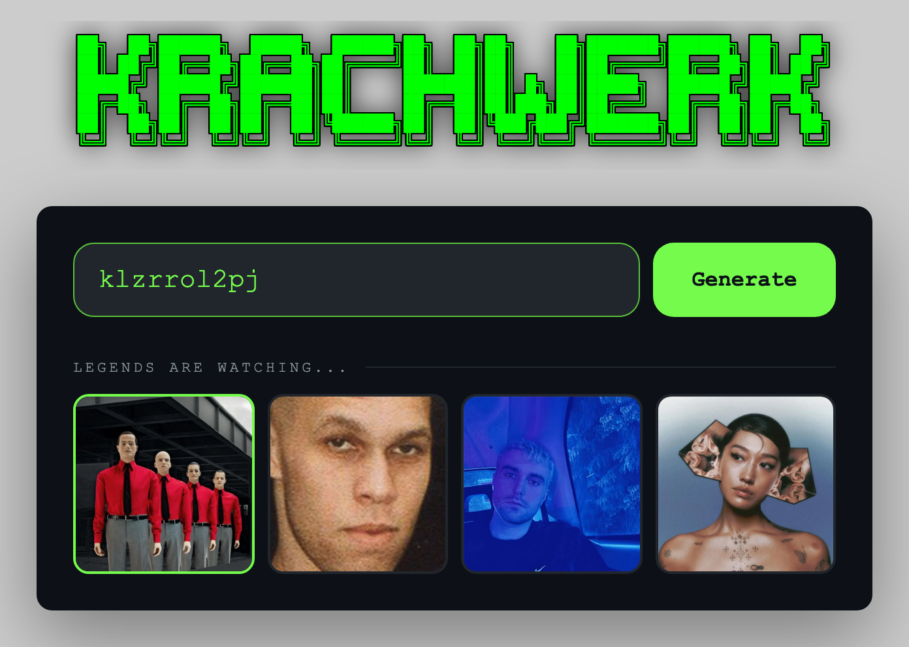
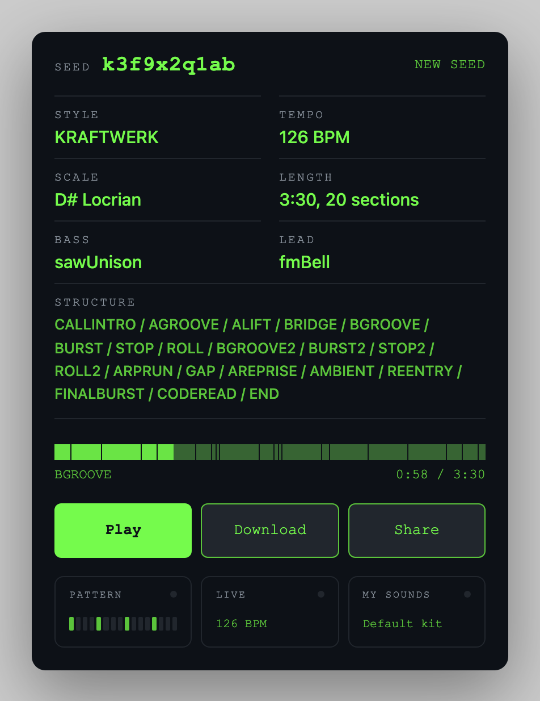
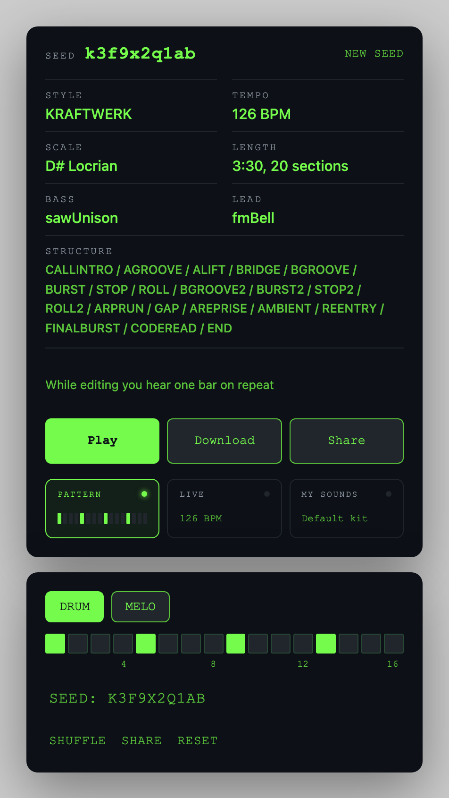

<div align="center">
  <h1>Krachwerk</h1>
  <a href="https://htjworld.github.io/krachwerk/">🔗 서비스 바로가기</a>
</div>

<br />

## Background

Kraftwerk의 음악을 듣다가 비슷한 결의 곡을 직접 만들어 보고 싶었습니다.
기존 음악 생성 도구는 조정해야 할 설정값이 너무 많거나, AI가 만든 결과물 특유의 어색함이 남아 오히려 이질적으로 들렸습니다.

Krachwerk는 설정 대신 시드 하나로 곡을 정합니다. 정해진 규칙에 따라 수학적으로 곡을 조립하기 때문에 10자 시드 약 3,656조 개가 모두 서로 다른 곡이 되고, 같은 시드는 언제 어디서 열어도 같은 곡을 냅니다.
가장 좋아하는 아티스트 네 명의 스타일과 테크노를 더해 5개 스타일, 14개 곡 구조로 3분 안팎의 곡을 만듭니다.

## Features

- 시드 하나로 곡 생성 — 빈 칸으로 생성하면 5개 스타일이 같은 확률로 나옵니다
- 스타일 선택 — Kraftwerk, Delroy Edwards, Fred again.., Peggy Gou 사진을 누르면 그 스타일의 시드가 채워집니다
- 구성이 바뀌는 3분 트랙 — 인트로부터 아웃트로까지 섹션마다 악기 구성이 달라지고, 재생바에서 섹션 단위로 이동할 수 있습니다
- 링크 공유 — 시드와 편집 내용이 주소 하나에 담겨, 받는 사람도 같은 곡을 듣습니다
- 패턴 편집 — 킥과 멜로디 스텝을 켜고 끄며 한 마디 루프로 바로 들어볼 수 있습니다
- 라이브 컨트롤 — 템포와 톤을 조절하고 두 슬롯에 저장해 둘 수 있습니다
- 내 소리 — 직접 녹음한 소리를 드럼과 목소리 자리에 끼워 넣습니다. 파일은 브라우저에만 저장됩니다
- WAV 다운로드, 한국어/영어 지원

## Preview

| 시드 입력과 스타일 선택 | 트랙 정보와 재생 | 패턴 편집 |
|-----------|-----------|-----------|
|  |  |  |

## Tech Stack

**Frontend**  
[](https://skillicons.dev)

**Infra**  
[](https://skillicons.dev)

## Getting Started

**Requirements**
- Node.js 20.19+ 또는 22.12+

**macOS / Linux**
```bash
git clone https://github.com/htjworld/krachwerk.git
cd krachwerk
npm install
npm run dev  # http://localhost:5173/krachwerk/
```

**Windows**
```bash
git clone https://github.com/htjworld/krachwerk.git
cd krachwerk
npm install
npm run dev  # http://localhost:5173/krachwerk/
```

**Deploy**

`main` 브랜치에 푸시하면 GitHub Actions가 테스트와 빌드를 거쳐 GitHub Pages로 배포합니다.

## License

MIT © htjworld

오디오 샘플은 모두 CC0 또는 퍼블릭 도메인이며 출처는 [`public/samples/CREDITS.txt`](./public/samples/CREDITS.txt)에 있습니다. `public/faces/`의 아티스트 이미지는 이 라이선스에 포함되지 않습니다.
